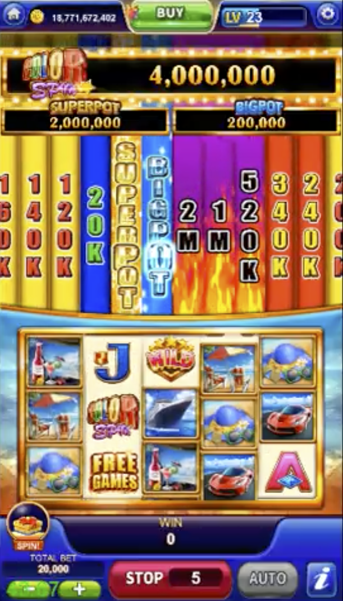
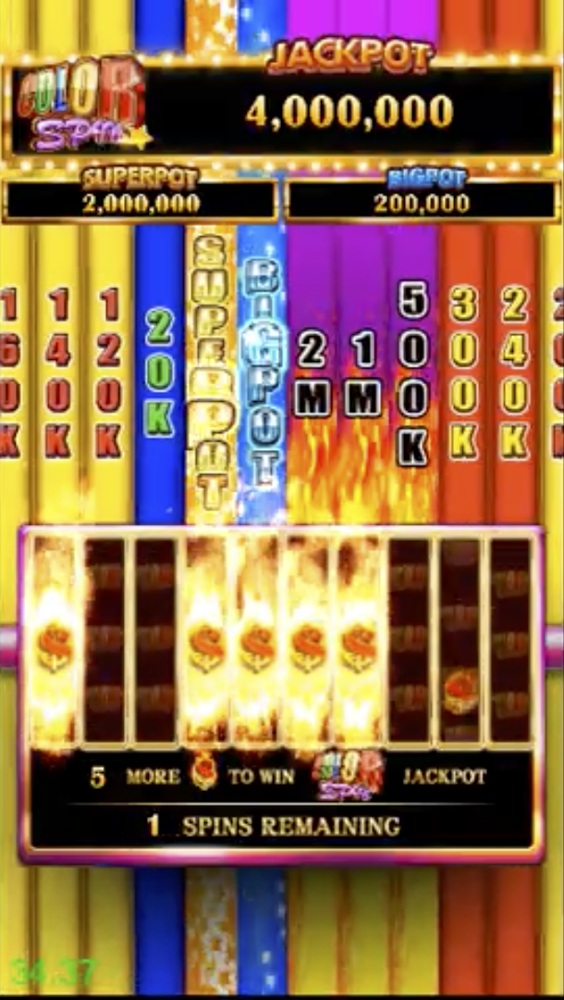

# ColorSpin (Client)
A Slot game I built in C#, Unity. in 2018.

With 3 modes
- Slot Game (Roller performance)
- Bonus Game
- Feature Game

## Video
> [demo video on youtube](https://youtu.be/lHvhE-ei7LI)
[](https://youtu.be/lHvhE-ei7LIg "Color Spin")

## Slot Game
]


## Bonus Game
]


## flow


## structure


Below is the simplified version of the application structure.
```
.
└── root
    │ 
    └── ColorSpinTicker (dir)（concrete）
    │ 
    └── CommonTicker (dir) (abstruct)
    │ 
    └── .... .cs - (roller, bonusGame, featureGame, Animation)

        
```


<br />
